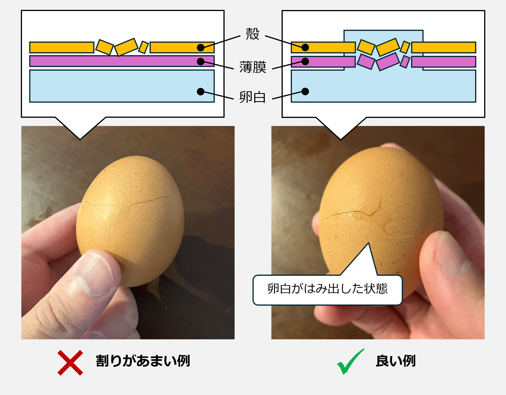
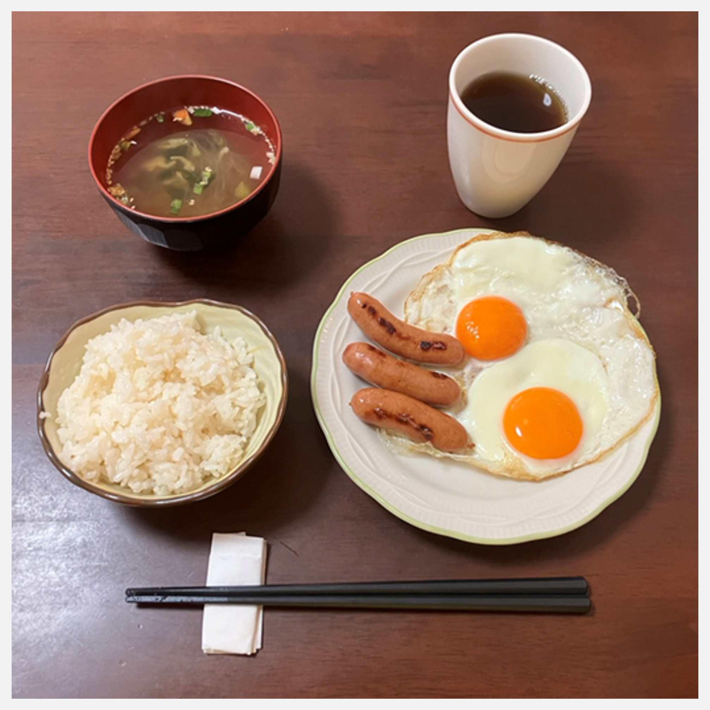

## 概要

難易度：★（簡単）

今日は記事のかさ増しを兼ねて、「目玉焼き」を作っていきます。

~~いやいや、簡単すぎやろ！！（セルフ突っ込み）~~

油断して火事にならないようにしましょう。

---

## 卵を割る

卵を割ります。どこか角にぶつけます。

図のように、**殻にひびが入り、かつ卵白が少しはみ出た状態**が割りやすいです。

卵白がはみ出てない状態で割ろうとすると高確率で黄身が破裂することに最近気づきました。

---

## 加熱する

お好みに合わせて火加減を調節してください。

私は卵アレルギーなので、本当は両面焼きたい派ですが…

今日は見栄えのために片面焼きにしてます。

---

## 完成

できました！良い朝です。

